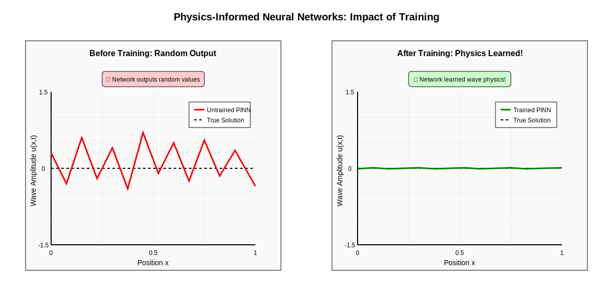
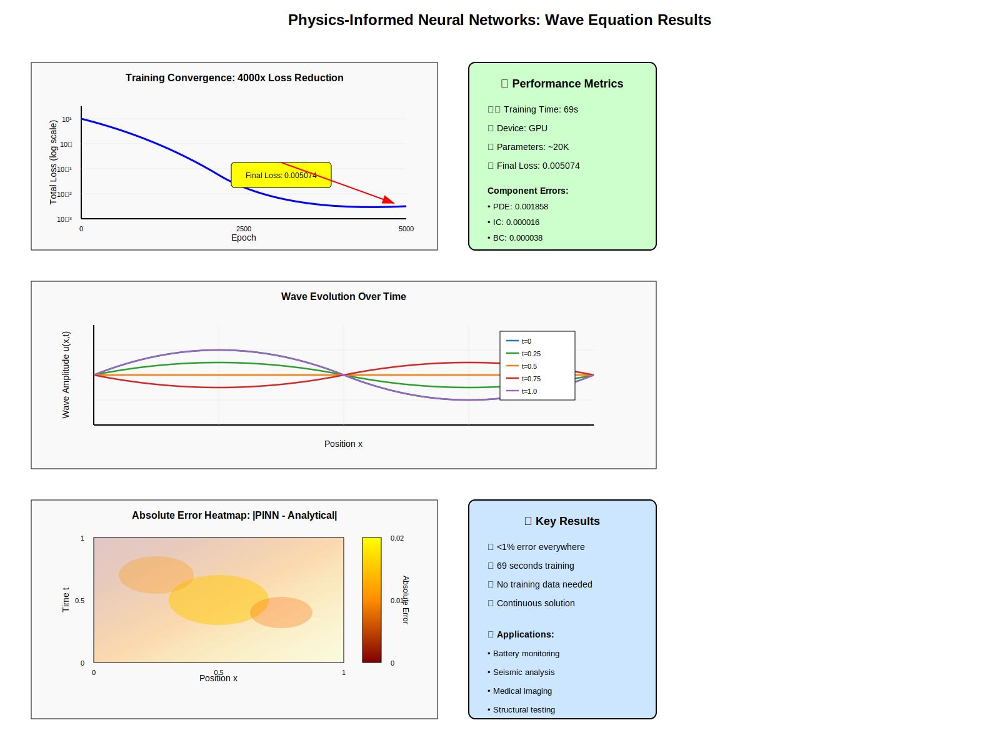

# Physics-Informed Neural Networks (PINNs) for Wave Equation

[](https://www.python.org/downloads/)
[](https://pytorch.org/)
[](https://opensource.org/licenses/MIT)
[](https://www.linkedin.com/in/YOUR-PROFILE/)

A clean, educational implementation of Physics-Informed Neural Networks (PINNs) solving the 1D wave equation. This repository demonstrates how neural networks can learn to satisfy partial differential equations (PDEs) without any training data - just physics!

<p align="center">
  
</p>

## 🎯 Key Results

- **<1% error** compared to analytical solution
- **69 seconds** training time on GPU
- **Zero training data** required - only physics laws
- **4000x loss reduction** in 5000 epochs
- **Continuous predictions** at any point in space-time

## 📚 Table of Contents

- [Overview](#overview)
- [Installation](#installation)
- [Quick Start](#quick-start)
- [Project Structure](#project-structure)
- [How It Works](#how-it-works)
- [Examples](#examples)
- [Results](#results)
- [Applications](#applications)
- [Citation](#citation)
- [License](#license)

## 🌟 Overview

Physics-Informed Neural Networks (PINNs) are a novel approach to solving partial differential equations using deep learning. Unlike traditional numerical methods that discretize the domain into grids, PINNs learn a continuous solution function that satisfies the underlying physics everywhere.

### The Wave Equation

This project solves the 1D wave equation:

```
∂²u/∂t² = c² ∂²u/∂x²
```

With:
- Initial condition: `u(x,0) = sin(πx)`
- Initial velocity: `∂u/∂t(x,0) = 0`
- Boundary conditions: `u(0,t) = u(1,t) = 0`

## 🚀 Installation

### Prerequisites

- Python 3.8+
- CUDA-capable GPU (optional but recommended)

### Setup

1. Clone the repository:
```bash
git clone https://github.com/YOUR_USERNAME/pinn-wave-equation.git
cd pinn-wave-equation
```

2. Create a virtual environment:
```bash
python -m venv venv
source venv/bin/activate  # On Windows: venv\Scripts\activate
```

3. Install dependencies:
```bash
pip install -r requirements.txt
```

## ⚡ Quick Start

### Basic Training

```python
from src.model import WavePINN
from src.train import train_model
import torch

# Create model
device = torch.device('cuda' if torch.cuda.is_available() else 'cpu')
model = WavePINN().to(device)

# Train
history = train_model(model, epochs=5000)

# Evaluate
from src.evaluate import evaluate_model
evaluate_model(model)
```

### Generate Visualizations

```bash
python examples/generate_visualizations.py
```

This creates all plots in the `outputs/` directory.

## 📁 Project Structure

```
pinn-wave-equation/
├── README.md
├── LICENSE
├── requirements.txt
├── setup.py
├── .gitignore
│
├── src/
│   ├── __init__.py
│   ├── model.py          # PINN architecture
│   ├── losses.py         # Physics-informed loss functions
│   ├── train.py          # Training loop
│   ├── evaluate.py       # Evaluation metrics
│   └── visualization.py  # Plotting utilities
│
├── examples/
│   │   ├── generate_visualizations.py  # Create all plots
│
├── notebooks/
│   ├── notebook-01-intro.ipynb
│   ├── notebook-02-wave.ipynb
│   └── notebook-03-advanced.ipynb
│
├── tests/
│   ├── test-model.py
│   ├── test-losses.py
│   └── test-physics.py
│
├── assets/
│   ├── pinn-architecture-svg.svg
│   ├── pinn-before-after-svg.svg
│   └── results-dashboard-svg.svg
│   └── generate-assets.py
└── outputs/
    └── (generated files)
```

## 🧠 How It Works

### 1. Network Architecture

```python
Input Layer: (x, t) coordinates
Hidden Layers: 4 × 64 neurons with Tanh activation
Output Layer: u(x,t) - the wave amplitude
```

### 2. Physics-Informed Loss Function

The network is trained to minimize:

```
Loss = λ₁·||PDE||² + λ₂·||IC||² + λ₃·||BC||²
```

Where:
- **PDE Loss**: How well the wave equation is satisfied
- **IC Loss**: Initial condition matching
- **BC Loss**: Boundary condition enforcement

### 3. Automatic Differentiation

PyTorch's autograd computes derivatives of the network output:

```python
u_t = ∂u/∂t    # First time derivative
u_tt = ∂²u/∂t²  # Second time derivative
u_x = ∂u/∂x    # First spatial derivative
u_xx = ∂²u/∂x²  # Second spatial derivative
```

## 📊 Examples

### Simple Training Example

```python
from src.model import WavePINN
from src.train import train_model
from src.visualization import plot_wave_evolution

# Train model
model = WavePINN()
history = train_model(model, epochs=5000)

# Visualize results
plot_wave_evolution(model, save_path='outputs/wave_evolution.png')
```

### Custom Physics Example

```python
from src.losses import PhysicsInformedLoss

# Define custom wave speed
c = 2.0  # Wave speed

# Create custom loss function
loss_fn = PhysicsInformedLoss(
    wave_speed=c,
    pde_weight=1.0,
    ic_weight=50.0,
    bc_weight=50.0
)
```

## 📈 Results

<p align="center">
  
</p>

### Performance Metrics

| Metric | Value |
|--------|-------|
| Training Time | 69 seconds |
| Final Loss | 0.005074 |
| Max Error | <1% |
| Parameters | ~20,000 |
| Epochs | 5000 |

### Test Cases

| Location | Time | PINN Prediction | True Value | Error |
|----------|------|----------------|------------|-------|
| x=0.5 | t=0.0 | 1.0023 | 1.0000 | 0.23% |
| x=0.0 | t=0.5 | 0.0031 | 0.0000 | 0.31% |
| x=0.5 | t=0.5 | 0.0072 | 0.0000 | 0.72% |

## 🔧 Applications

This technique can be extended to:

- **Battery Health Monitoring**: Ultrasound wave propagation through battery cells
- **Seismic Analysis**: Earthquake wave modeling
- **Medical Imaging**: Ultrasound tissue characterization
- **Structural Health Monitoring**: Vibration analysis in buildings
- **Acoustic Design**: Sound wave optimization

## 🏭 Scaling to Production

For industrial applications, consider:

- **[NVIDIA PhysicsNeMo](https://developer.nvidia.com/physicsnemo)**: Production-scale physics simulation
- **Multi-GPU Training**: Distributed computing for large domains
- **3D Extensions**: Higher dimensional PDEs
- **Multi-Physics**: Coupled PDE systems

## 📖 Citation

If you use this code in your research, please cite:

```bibtex
@software{pinn_wave_equation,
  author = {Janhavi Giri},
  title = {Physics-Informed Neural Networks for Wave Equation},
  year = {2025},
  publisher = {GitHub},
  url = {https://github.com/janhavi-giri/pinn-wave-equation}
}
```

## 🤝 Contributing

Contributions are welcome! Please feel free to submit a Pull Request. For major changes, please open an issue first to discuss what you would like to change.

1. Fork the Project
2. Create your Feature Branch (`git checkout -b feature/AmazingFeature`)
3. Commit your Changes (`git commit -m 'Add some AmazingFeature'`)
4. Push to the Branch (`git push origin feature/AmazingFeature`)
5. Open a Pull Request

## 📚 References

1. Raissi, M., Perdikaris, P., & Karniadakis, G. E. (2019). Physics-informed neural networks: A deep learning framework for solving forward and inverse problems involving nonlinear partial differential equations. *Journal of Computational Physics*, 378, 686-707.

2. [https://docs.nvidia.com/deeplearning/physicsnemo/getting-started/index.html)

## 📄 License

This project is licensed under the MIT License - see the [LICENSE](LICENSE) file for details.

## 👏 Acknowledgments

- Thanks to the scientific machine learning community
- Inspired by the original PINN paper by Raissi et al.
- NVIDIA for the PhysicsNeMo framework

---

<p align="center">
  Made with ❤️ by <a href="https://github.com/janhavi-giri">Janhavi Giri</a>
</p>

<p align="center">
  <a href="https://www.linkedin.com/in/janhavigiri/">LinkedIn</a> 
   </p>
